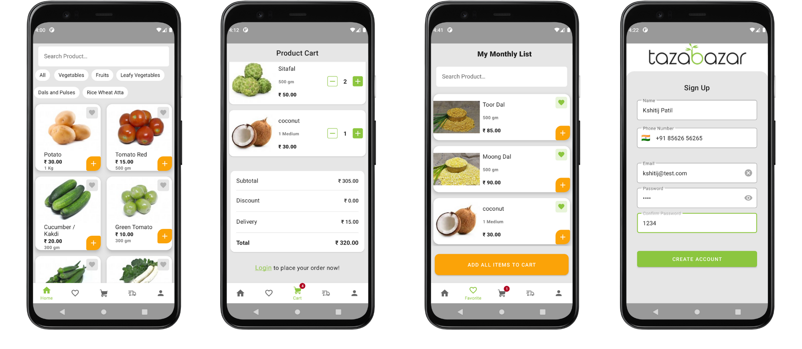

# TazaBazar

TazaBazar is a Grocery App written mainly with a bottom-up test-driven approach. The app uses MVVM architecture for Data Flow and follows Clean Architecture Guidelines to maintain the business logic.

## Download

## API Server
[TazaBazar-Backend](https://github.com/Kshitij09/TazaBazar-Backend)

## Libraries used
* [Room](https://developer.android.com/training/data-storage/room) - Data Persistence
* [Jetpack DataStore](https://developer.android.com/topic/libraries/architecture/datastore) - Managing Shared Preferences
* [Navigation Component](https://developer.android.com/guide/navigation) - Managing navigation across fragments
* [Retrofit2](https://square.github.io/retrofit/) & [OkHttp3](https://square.github.io/okhttp/) - Networking
* [Coroutines](https://kotlinlang.org/docs/coroutines-overview.html) - Asynchronous programming
* [Kotlin Flow](https://kotlinlang.org/docs/flow.html) - Reactive streams
* [ThreeTenAbp](https://github.com/JakeWharton/ThreeTenABP) - Managing Date Time
* [Timber](https://github.com/JakeWharton/timber) - Logging
* [tfcporciuncula/phonemoji](https://github.com/tfcporciuncula/phonemoji) - Internation Phone Number Input
* [ArrowKt-Either](https://arrow-kt.io/docs/0.11/apidocs/arrow-core-data/arrow.core/-either/) - Functional Modelling of Exceptions
* [WorkManager](https://developer.android.com/topic/libraries/architecture/workmanager) - Scheduling Background tasks

## Highlights
* **Refresh Token API Call optimization**

    TazaBazar Backend uses JWT based authentication, which requires you to refresh the access token every 15 minutes. Instead of scheduling a `PeriodicWorkRequest` for this task, the app defers refreshing access token till it comes in the foreground to save wasteful API calls made in the background. A use-case ([`ObserveSessionStateUseCase`](app/src/main/java/com/kshitijpatil/tazabazar/domain/ObserveSessionStateUseCase.kt)), acting as Single Source of Truth for Session State, exposes a `StateFlow` of `SessionState`. This flow is consumed by many UI components for producing dynamic UI, as well as by a ViewModel which simply enqueues a Unique `OneTimeWorkRequest` when a `SessionExpired` state is emitted.
* **Lazy User Registration UX**
    
    App uses lazy or soft User Registration flow in favor of gradual engagement. Users can directly start browsing the products, create Favorite Lists, add items to the Cart, and we only ask for Login/SignUp when they're about to place an order. This UX was made possible due to the robust implementation of Observable Session State Manager mentioned above.
* **Manual Dependency Injection**

    Yes, this is a feature! Module-based manual DI sped up the early-stage development of the app where dependencies were constantly changing. checkout `di` package to know more.
* **Fail-safe Product Search Results** ([`SearchProductsUseCase`](app/src/main/java/com/kshitijpatil/tazabazar/domain/SearchProductsUseCase.kt))

    
    `SearchProductsUseCase` takes care of having some data to show up in case of any errors. It first queries the local source and returns the result immediately. It then queries the remote source in either of two cases:

    1. `forceRefresh=true`
    1. search results from the local source were empty

    While querying the remote source, it first emits a Loading state with `responseOrigin=REMOTE` (UI Components might show loading indicators here) and emits Success/Error based on the response.

* Use of [`Either`](https://arrow-kt.io/docs/0.11/apidocs/arrow-core-data/arrow.core/-either/) for Modelling Domain Exceptions

    `AuthRepository` was interacting with many sources that could potentially throw an exception and we needed a way to communicate some of these errors as is while wrapping the others in some generic form. This was an ideal place to use Either type from functional programming to model the Exceptions as concrete types. We model API specific errors using sealed class hierarchies such as `RegisterException` from the [`RegisterRepository`](app/src/main/java/com/kshitijpatil/tazabazar/data/RegisterRepository.kt) and Presentation layer thus uses this information to show appropriate error message on the UI.
* **Reactive Field Validation**

    `SignUpFragment` was managing multiple TextFields that require validation and `Register` button is enabled when all of them are valid. Also, there was a common pattern of keeping focus state, error state, communicate ViewModel about value changes, to survive the input values beyond Fragment Lifecycle. Checkout [`launchTextInputLayoutObservers`](https://github.com/Kshitij09/TazaBazar/blob/964920a03b853e7339632891cddbb7efb8411836/app/src/main/java/com/kshitijpatil/tazabazar/util/UiUtils.kt#L50) which reactively handles all of these cases using Kotlin Flows.

* **Unit Tests**

    App has unit tests written for most of the components having business logic which involve DAOs, Repositories, Use Cases, etc. Checkout `app/src/test` sourceSet to know more.

## Credits

* UI/UX of this App is heavily inspired by a [Case Study](https://www.behance.net/gallery/123261981/Grocery-Mobile-App-UI-UX-Design-Case-Study) posted on Behance.
* Many code snippets are borrowed from two absolute gem repositories:
    * [chrisbanes/tivi](https://github.com/chrisbanes/tivi)
    * [google/iosched](https://github.com/google/iosched)

## **Disclaimer**
_All the content shown in this app is taken from [siddhagirinaturals.com](https://www.siddhagirinaturals.com/) and is only used for educational purpose. We do not seek to act on behalf of them and have no official business relations with siddhagiri naturals._

License
-------

    Copyright 2021 Kshitij Patil

    Licensed under the Apache License, Version 2.0 (the "License");
    you may not use this file except in compliance with the License.
    You may obtain a copy of the License at

    http://www.apache.org/licenses/LICENSE-2.0

    Unless required by applicable law or agreed to in writing, software
    distributed under the License is distributed on an "AS IS" BASIS,
    WITHOUT WARRANTIES OR CONDITIONS OF ANY KIND, either express or implied.
    See the License for the specific language governing permissions and
    limitations under the License.

